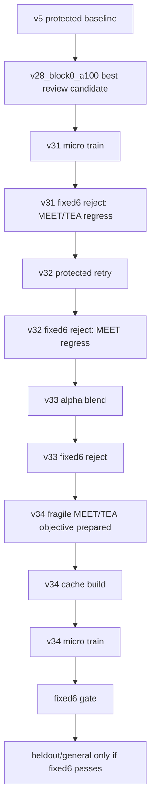

# GEMMANIMA Parallel Training Implementation Plan

> **For agentic workers:** REQUIRED SUB-SKILL: Use superpowers:subagent-driven-development (recommended) or superpowers:executing-plans to implement this plan task-by-task. Steps use checkbox (`- [ ]`) syntax for tracking.

**Goal:** Run GEMMANIMA training continuously but safely, using RTX 4070 Ti SUPER only, while protecting v5 and advancing from v34 fragile text repair toward a promotable candidate.

**Architecture:** Treat GPU work as a single serialized training/evaluation queue and run all non-GPU work in parallel lanes. Every candidate must pass fixed6 first; only fixed6-passing candidates may move to heldout/general gates. v31/v32/v33 are archived as rejected evidence and must not be expanded.

**Tech Stack:** PowerShell, `E:/ComfyUI_sage/python_embeded/python.exe`, external cache/train/render scripts under `E:/anima_gemma_swap/scripts/core`, repo CLI `python -m gemmanima.cli`, JSON/JSONL artifacts under `reports/text_rendering_qwen_baseline`, checkpoints under `runs/cache`.

---

## Current Position



Current stage: `I`, with `reports/text_rendering_qwen_baseline/v34_target_refresh_manifest.json` prepared.

## Work Lanes

- **Mina / GPU Queue:** Runs only one 4070 job at a time: target cache, Gemma cache, micro train, render.
- **Luna / Metric Gate:** Builds compare reports, metric summaries, contact sheets, and pass/fail decisions.
- **Sera / Manifest QA:** Audits JSON/JSONL, cache index pairing, source-bucket prefix safety, and v5 protection flags.
- **Yuri / Release Ledger:** Updates workflow status, roadmap notes, and heartbeat instructions; never promotes without gates.

## Files And Responsibilities

- `reports/text_rendering_qwen_baseline/v34_target_refresh_manifest.json`: v34 non-GPU target-refresh contract.
- `reports/text_rendering_qwen_baseline/v34_fragile_target_refresh_prompts.jsonl`: 10 v34 prompt records split into fragile and replay buckets.
- `reports/text_rendering_qwen_baseline/v34_surface_curriculum_weights.json`: per-index sample weights for training.
- `reports/text_rendering_qwen_baseline/v34_artifact_gate_loss_config.json`: source-bucket weight clamp for trainer.
- `reports/text_rendering_qwen_baseline/v34_cache_pairing_audit.json`: to create after target/Gemma cache generation.
- `reports/text_rendering_qwen_baseline/v34_micro_train_result.json`: to create after training.
- `reports/text_rendering_qwen_baseline/metrics_summary_v34_fixed6.json`: to create after fixed6 render/compare.
- `reports/text_rendering_qwen_baseline/workflow_status_v34.json`: final stage ledger for this cycle.

## Task 1: Sera Audits v34 Manifest Before GPU Work

**Files:**
- Read: `reports/text_rendering_qwen_baseline/v34_target_refresh_manifest.json`
- Read: `reports/text_rendering_qwen_baseline/v34_fragile_target_refresh_prompts.jsonl`
- Read: `reports/text_rendering_qwen_baseline/v34_surface_curriculum_weights.json`
- Create: `reports/text_rendering_qwen_baseline/v34_manifest_audit.json`

- [ ] **Step 1: Validate JSON and JSONL**

Run:

```powershell
Get-Content -Raw 'reports/text_rendering_qwen_baseline/v34_target_refresh_manifest.json' | python -m json.tool > $null
Get-Content -Raw 'reports/text_rendering_qwen_baseline/v34_surface_curriculum_weights.json' | python -m json.tool > $null
Get-Content -Raw 'reports/text_rendering_qwen_baseline/v34_artifact_gate_loss_config.json' | python -m json.tool > $null
@'
import json
from pathlib import Path
p = Path("reports/text_rendering_qwen_baseline/v34_fragile_target_refresh_prompts.jsonl")
rows = [json.loads(line) for line in p.read_text(encoding="utf-8").splitlines() if line.strip()]
assert len(rows) == 10
assert len({r["idx"] for r in rows}) == 10
assert {r["cache_source_bucket"] for r in rows} == {"00_fragile_fixed6", "10_fixed6_replay"}
assert all(r["sample_weight"] > 0 for r in rows)
print({"records": len(rows), "unique_idx": len({r["idx"] for r in rows})})
'@ | python -
```

Expected: exit `0`, `records: 10`.

- [ ] **Step 2: Write audit**

Create `v34_manifest_audit.json` with:

```json
{
  "stage": "text_preservation_v34_manifest_audit",
  "status": "pass",
  "record_count": 10,
  "unique_idx_count": 10,
  "bucket_counts": {
    "00_fragile_fixed6": 7,
    "10_fixed6_replay": 3
  },
  "protected_baseline": "v5",
  "v5_default_changed": false,
  "gpu_permission": "eligible_for_4070_cache_build_only"
}
```

## Task 2: Mina Builds v34 Target Cache On 4070

**Files:**
- Read: `reports/text_rendering_qwen_baseline/v34_fragile_target_refresh_prompts.jsonl`
- Create: `reports/text_rendering_qwen_baseline/v34_00_fragile_fixed6_prompts.jsonl`
- Create: `reports/text_rendering_qwen_baseline/v34_10_fixed6_replay_prompts.jsonl`
- Create: `runs/cache/text_preservation_blended_v34/targets/*.pt`

- [ ] **Step 1: Split prompts by source bucket**

Run:

```powershell
@'
import json
from pathlib import Path
src = Path("reports/text_rendering_qwen_baseline/v34_fragile_target_refresh_prompts.jsonl")
out = {
    "00_fragile_fixed6": Path("reports/text_rendering_qwen_baseline/v34_00_fragile_fixed6_prompts.jsonl"),
    "10_fixed6_replay": Path("reports/text_rendering_qwen_baseline/v34_10_fixed6_replay_prompts.jsonl"),
}
rows = [json.loads(line) for line in src.read_text(encoding="utf-8").splitlines() if line.strip()]
for bucket, path in out.items():
    selected = [r for r in rows if r["cache_source_bucket"] == bucket]
    path.write_text("".join(json.dumps(r, ensure_ascii=False) + "\n" for r in selected), encoding="utf-8")
print({bucket: sum(1 for r in rows if r["cache_source_bucket"] == bucket) for bucket in out})
'@ | python -
```

Expected: `00_fragile_fixed6: 7`, `10_fixed6_replay: 3`.

- [ ] **Step 2: Run target cache for fragile bucket**

Run:

```powershell
$env:CUDA_VISIBLE_DEVICES='0'
& 'E:/ComfyUI_sage/python_embeded/python.exe' 'E:/anima_gemma_swap/scripts/core/06_cache_targets.py' `
  --subset 'reports/text_rendering_qwen_baseline/v34_00_fragile_fixed6_prompts.jsonl' `
  --outdir 'runs/cache/text_preservation_blended_v34/targets' `
  --shard 1000 `
  --shard-prefix '00_fragile_fixed6' `
  --resume
```

Expected: `runs/cache/text_preservation_blended_v34/targets/00_fragile_fixed6_0000.pt`.

- [ ] **Step 3: Run target cache for replay bucket**

Run:

```powershell
$env:CUDA_VISIBLE_DEVICES='0'
& 'E:/ComfyUI_sage/python_embeded/python.exe' 'E:/anima_gemma_swap/scripts/core/06_cache_targets.py' `
  --subset 'reports/text_rendering_qwen_baseline/v34_10_fixed6_replay_prompts.jsonl' `
  --outdir 'runs/cache/text_preservation_blended_v34/targets' `
  --shard 1000 `
  --shard-prefix '10_fixed6_replay' `
  --resume
```

Expected: `runs/cache/text_preservation_blended_v34/targets/10_fixed6_replay_0000.pt`.

## Task 3: Mina Builds v34 Gemma Cache On 4070

**Files:**
- Read: `runs/cache/text_preservation_blended_v34/targets`
- Create: `runs/cache/text_preservation_blended_v34/gemma/*.pt`

- [ ] **Step 1: Run Gemma cache**

Run:

```powershell
$env:CUDA_VISIBLE_DEVICES='0'
& 'E:/ComfyUI_sage/python_embeded/python.exe' 'E:/anima_gemma_swap/scripts/core/07_cache_gemma_batched.py' `
  --subset 'reports/text_rendering_qwen_baseline/v34_fragile_target_refresh_prompts.jsonl' `
  --target-dir 'runs/cache/text_preservation_blended_v34/targets' `
  --outdir 'runs/cache/text_preservation_blended_v34/gemma' `
  --patterns '00_fragile_fixed6_*.pt,10_fixed6_replay_*.pt' `
  --batch-size 8 `
  --resume
```

Expected:
- `runs/cache/text_preservation_blended_v34/gemma/00_fragile_fixed6_0000.pt`
- `runs/cache/text_preservation_blended_v34/gemma/10_fixed6_replay_0000.pt`

## Task 4: Sera Writes Cache Pairing Audit

**Files:**
- Read: `runs/cache/text_preservation_blended_v34/targets/*.pt`
- Read: `runs/cache/text_preservation_blended_v34/gemma/*.pt`
- Create: `reports/text_rendering_qwen_baseline/v34_cache_pairing_audit.json`

- [ ] **Step 1: Compare target/Gemma indices**

Run a Python audit that loads every shard with `torch.load(..., map_location="cpu")`, extracts record indices, and asserts:

```python
required_idx_count = 10
target_unique_idx_count = 10
gemma_unique_idx_count = 10
missing_target_indices = []
missing_gemma_indices = []
extra_target_indices = []
extra_gemma_indices = []
shard_prefixes = ["00_fragile_fixed6", "10_fixed6_replay"]
```

Expected decision JSON:

```json
{
  "stage": "text_preservation_v34_cache_pairing_audit",
  "decision": {
    "status": "pass",
    "training_permission": "eligible_for_one_micro_train_manifest_only"
  }
}
```

## Task 5: Mina Runs One v34 Micro Train

**Files:**
- Read: `reports/text_rendering_qwen_baseline/v34_cache_pairing_audit.json`
- Read: `runs/cache/text_preservation_blended_v28/bridge/text_preservation_blended_v28_block0_a100_bridge.pt`
- Create: `runs/cache/text_preservation_blended_v34/bridge/text_preservation_blended_v34_fragile_bridge.pt`
- Create: `reports/text_rendering_qwen_baseline/v34_micro_train_result.json`

- [ ] **Step 1: Run short training**

Run:

```powershell
$env:CUDA_VISIBLE_DEVICES='0'
New-Item -ItemType Directory -Force 'runs/cache/text_preservation_blended_v34/bridge' | Out-Null
& 'E:/ComfyUI_sage/python_embeded/python.exe' 'E:/anima_gemma_swap/scripts/core/08_train_stream_batched.py' `
  --targets 'runs/cache/text_preservation_blended_v34/targets' `
  --gemma 'runs/cache/text_preservation_blended_v34/gemma' `
  --out 'runs/cache/text_preservation_blended_v34/bridge/text_preservation_blended_v34_fragile_bridge.pt' `
  --epochs 1 `
  --lr 5e-8 `
  --batch-size 4 `
  --accum 1 `
  --val 10 `
  --resume-kv 'runs/cache/text_preservation_blended_v28/bridge/text_preservation_blended_v28_block0_a100_bridge.pt' `
  --kv-anchor 'runs/cache/text_preservation_blended_v28/bridge/text_preservation_blended_v28_block0_a100_bridge.pt' `
  --kv-anchor-lambda 0.05 `
  --surface-curriculum 'reports/text_rendering_qwen_baseline/v34_surface_curriculum_weights.json' `
  --artifact-gate-loss-config 'reports/text_rendering_qwen_baseline/v34_artifact_gate_loss_config.json' `
  --per-case-gate-loss-budget 0.0001 2>&1 | Tee-Object -FilePath 'reports/text_rendering_qwen_baseline/v34_micro_train.log'
exit $LASTEXITCODE
```

Expected: exit `0`, checkpoint exists. Do not promote.

## Task 6: Luna Runs fixed6 Gate Immediately

**Files:**
- Create: `reports/text_rendering_qwen_baseline/v34_fixed6_eval_plan.json`
- Create: `runs/images/text_rendering_qwen_baseline/gemma_text_preservation_blended_v34_fragile/*.png`
- Create: `reports/text_rendering_qwen_baseline/metrics_summary_v34_fixed6.json`
- Create: `reports/text_rendering_qwen_baseline/contact_sheet_text_preservation_blended_v34_fixed6.png`

- [ ] **Step 1: Build eval plan**

Run:

```powershell
python -m gemmanima.cli text-rendering-qwen-baseline-plan `
  --student-checkpoint 'runs/cache/text_preservation_blended_v34/bridge/text_preservation_blended_v34_fragile_bridge.pt' `
  --student-name 'gemma_text_preservation_blended_v34_fragile' `
  --max-cases 6 `
  --json | Set-Content -Encoding utf8 'reports/text_rendering_qwen_baseline/v34_fixed6_eval_plan.json'
```

- [ ] **Step 2: Render student fixed6 on 4070**

Run:

```powershell
$env:CUDA_VISIBLE_DEVICES='0'
$env:GEMMA_EMBED_ON_GPU='1'
& 'E:/ComfyUI_sage/python_embeded/python.exe' 'E:/anima_gemma_swap/scripts/core/11_eval_generate.py' `
  --mode gemma `
  --prompts 'reports/text_rendering_qwen_baseline/prompts.jsonl' `
  --name 'gemma_text_preservation_blended_v34_fragile' `
  --out-root 'runs/images/text_rendering_qwen_baseline' `
  --limit 6 `
  --seed 440001 `
  --size 512 `
  --steps 20 `
  --cfg 4.5 `
  --sampler euler `
  --scheduler normal `
  --unet-dtype default `
  --adapter 'runs/cache/text_preservation_blended_v34/bridge/text_preservation_blended_v34_fragile_bridge.pt'
```

- [ ] **Step 3: Compare against Qwen and v5**

For every case in `v34_fixed6_eval_plan.json`, copy raw images to case names, run `python -m gemmanima.cli write-compare-report`, then write `metrics_summary_v34_fixed6.json`.

Pass criterion:

```json
{
  "decision": {
    "status": "pass_fixed6_metric_gate",
    "required": "all six fixed cases delta_vs_v5 <= 0.0",
    "hard_blockers": ["MEET AT DAWN", "TEA"]
  }
}
```

If any fixed case regresses, stop v34 and write `workflow_status_v34.json` with `do_not_expand`.

## Task 7: Luna Expands Only If fixed6 Passes

**Files:**
- Read: `reports/text_rendering_qwen_baseline/metrics_summary_v34_fixed6.json`
- Create if pass: heldout/general eval reports for v34

- [ ] **Step 1: Gate check**

Run:

```powershell
@'
import json
from pathlib import Path
p = Path("reports/text_rendering_qwen_baseline/metrics_summary_v34_fixed6.json")
d = json.loads(p.read_text(encoding="utf-8"))
assert d["decision"]["status"] == "pass_fixed6_metric_gate"
assert not d["decision"].get("regressions")
print("fixed6 pass; heldout/general expansion allowed")
'@ | python -
```

Expected: expansion allowed only on pass.

- [ ] **Step 2: Heldout/general expansion**

Use existing heldout/general plan commands for `student_name=gemma_text_preservation_blended_v34_fragile` and checkpoint:

```text
runs/cache/text_preservation_blended_v34/bridge/text_preservation_blended_v34_fragile_bridge.pt
```

Stop if heldout readable/failed or general scene metrics miss existing release thresholds.

## Task 8: Yuri Writes Workflow Ledger And Verification

**Files:**
- Create: `reports/text_rendering_qwen_baseline/workflow_status_v34.json`
- Optionally modify: `docs/training_pipeline.md`
- Optionally modify: `docs/verification_plan.md`

- [ ] **Step 1: Write ledger**

`workflow_status_v34.json` must include:

```json
{
  "protected_baseline": "v5",
  "v5_default_changed": false,
  "v34_fixed6_status": "pass_or_reject",
  "promotion_allowed": false,
  "next_step": "heldout/general if fixed6 pass, otherwise new objective design"
}
```

- [ ] **Step 2: Run verification**

Run:

```powershell
python -m compileall -q gemmanima
& 'E:/ComfyUI_sage/python_embeded/python.exe' -m py_compile `
  'E:/anima_gemma_swap/scripts/core/08_train_stream_batched.py' `
  'E:/anima_gemma_swap/scripts/core/11_eval_generate.py'
git diff --check
python -m pytest -q
nvidia-smi --query-gpu=index,name,memory.used,memory.total,utilization.gpu --format=csv,noheader
```

Expected:
- `pytest`: `226 passed` or explain any new failure.
- GPU 0 may be used during work, then should return near idle.
- GPU 1 / RTX 5060 must not be selected by any command.

## Stop Rules

- Stop candidate expansion immediately if fixed6 fails.
- Stop all promotion/default work unless fixed6, heldout, and general gates pass.
- Stop GPU work if `CUDA_VISIBLE_DEVICES` is not `0`.
- Stop if a command would write into v5/default/release paths.
- Do not run v31/v32/v33 heldout/general; they are rejected evidence only.

## Parallel Execution Policy

GPU tasks are serialized:

```text
Task 2 -> Task 3 -> Task 4 -> Task 5 -> Task 6 render
```

Non-GPU tasks can run in parallel while Mina uses the 4070:

```text
Sera: manifest/cache audit
Luna: metric script/contact sheet templates
Yuri: ledger/docs/heartbeat updates
```

Subagents should not edit the same output files simultaneously. Mina owns `runs/cache` and `runs/images`; Luna owns metric summaries/contact sheets; Sera owns audits; Yuri owns ledger/docs.
